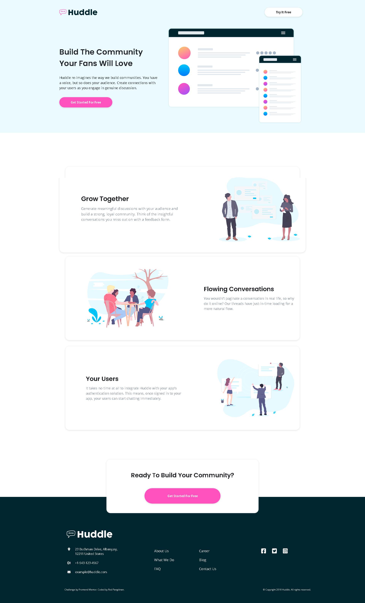

# Frontend Mentor - Huddle landing page with alternating feature blocks solution

This is a solution to the [Huddle landing page with alternating feature blocks challenge on Frontend Mentor](https://www.frontendmentor.io/challenges/huddle-landing-page-with-alternating-feature-blocks-5ca5f5981e82137ec91a5100). Frontend Mentor challenges help you improve your coding skills by building realistic projects. 

## Table of contents

- [Overview](#overview)
  - [The challenge](#the-challenge)
  - [Screenshot](#screenshot)
  - [Links](#links)
- [My process](#my-process)
  - [Built with](#built-with)
  - [Useful resources](#useful-resources)
- [Author](#author)

## Overview

### The challenge

Users should be able to:

- View the optimal layout for the site depending on their device's screen size
- See hover states for all interactive elements on the page

### Screenshot

### Links

- Solution URL: [Solution](https://www.frontendmentor.io/solutions/huddle-landing-page-with-alternating-feature-blocks-using-bootstrap-ese4xmrIrX)
- Live Site URL: [Live Website](https://redpangilinan.github.io/huddle-landing-page-with-alternating-blocks/)

## My process

### Built with

- HTML
- CSS
- JavaScript
- [Bootstrap](https://getbootstrap.com/) - CSS Framework
- [AOS](https://michalsnik.github.io/aos/) - Animate on Scroll Library

### Useful resources

- [Official Bootstrap Documentation](https://getbootstrap.com/docs/5.0/getting-started/introduction/)
- [Animate on Scroll Library](https://michalsnik.github.io/aos/)

## Author

- Website - [Red Pangilinan](https://redpangilinan.github.io/portfolio/)
- Frontend Mentor - [@redpangilinan](https://www.frontendmentor.io/profile/redpangilinan)
- Twitter - [@repulzor](https://twitter.com/repulzor)
- Facebook - [Red Pangilinan](https://www.facebook.com/redpangilinan715/)
- GitHub - [redpangilinan](https://github.com/redpangilinan)